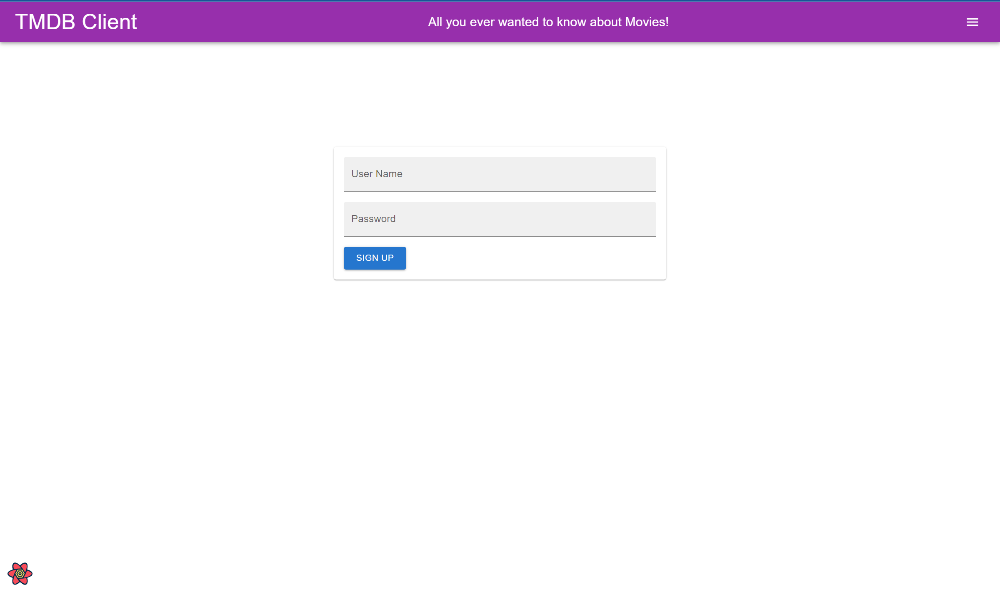

# Web App Dev 2 - Assignment 1 - ReactJS app.

Name: Corey Shanahan

## Overview.

### New Pages.

- Login page
- Sign up page
- (modified) Home page - added pagination
- (modified) upcoming movies page - added pagination
- Top rated movies page
- Discover Tv show page
- Popular Actors page
- Favoutite Tv shows page
- Watch Later page

- (modified) Movie details page - added image slideshow, added cast chips, added simliar movies chips
- Tv show details page
- Actors details page

### New Features.

- Authentication (using Firebase)
- Create a fantasy movie (Basic)
- Pagination on movies, actors and tv shows

## Setup requirements.

None

## TMDB endpoints.

### Movies

- /movie/{movie_id}/similar - A list of similar movies.
- /movie/{movie_id}/credits - the cast & crew of the movie
- /movie/top_rated - the current top rated movies

### Actors

- /person/popular - A list of popular actors.
- /person/{person_id} - gets the details of an actor
- /person/{person_id}/movie_credits - list of movies an actor has starred in
- /person/{person_id}/tv_credits - list of tv shows the actor has starred in
- /person/{person_id}/images - list of images of an actor

### Tv shows

- /tv/popular - The current popular tv shows.
- /tv/{tv_id} - Gets the details of a show
- /tv/{tv_id}/credits - gets the cast & crew of a tv show
- /tv/{tv_id}/images - the images related to a show

## App Design.

### Component catalogue.

### UI Design.

[ Insert screenshots of the **new app pages** you developed (including modified existing pages), Have an appropriate caption for each one (see example below).

> Shows detailed information on a movie. The movie posters are now in a slideshow. The name's of the cast are links to their details page. Similar movies are also links to their details page.

> Shows the 4th page in the popular movies page.

> Shows the login page.

> Shows the sign up page.

> Shows a list of popular actors.

> Shows the details of the actor. The actors profile pictures are in a slideshow. If the actor is dead, it will display the death day.

> Shows all the tv shows that the user has favored.

> Shows the details of a tv show.

> Shows the current popular tv shows.

> Shows the list of must watch that the user has selected.

### Routing.

- /movies/watchlater (Private) - displays the custom list of the user must watch movies.
- /movies/toprated (Private) - displays the current top rated movies.
- /tvshows/discover (Private) - displays a list of tv shows.
- /actors/popular (Private) - display a list of current popluar actors.
- /actors/:id (Private) - displays the details of an actor.
- /tvshows/favourite (Private) - displays the users favourite tv shows.
- /tvshow/:id (Private) - diplays the details of a tv show
- /login (Public) - displays a login form
- /signup (Public) - displays a sign up form

## Independent learning (If relevant).

- src/privateRoute.js - Private routes https://medium.com/@dennisivy/creating-protected-routes-with-react-router-v6-2c4bbaf7bc1c
- src/components/slideShow/index.js - Image slideshow https://www.npmjs.com/package/react-slideshow-image
- src/auth/authUser.js - Authenication - https://blog.logrocket.com/user-authentication-firebase-react-apps/
